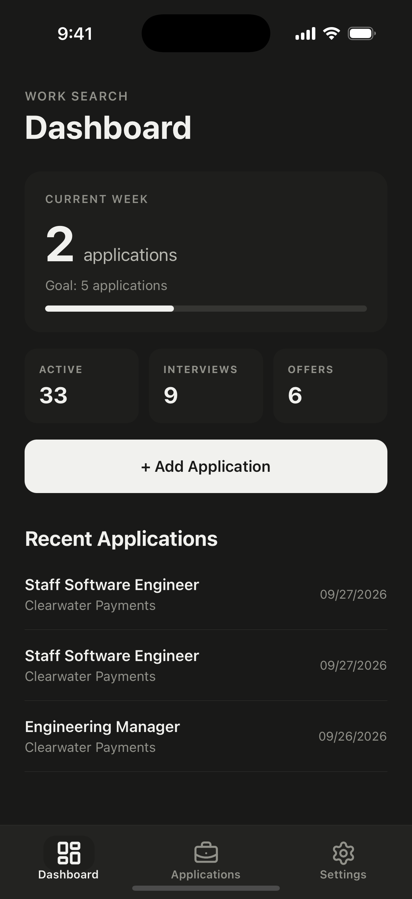
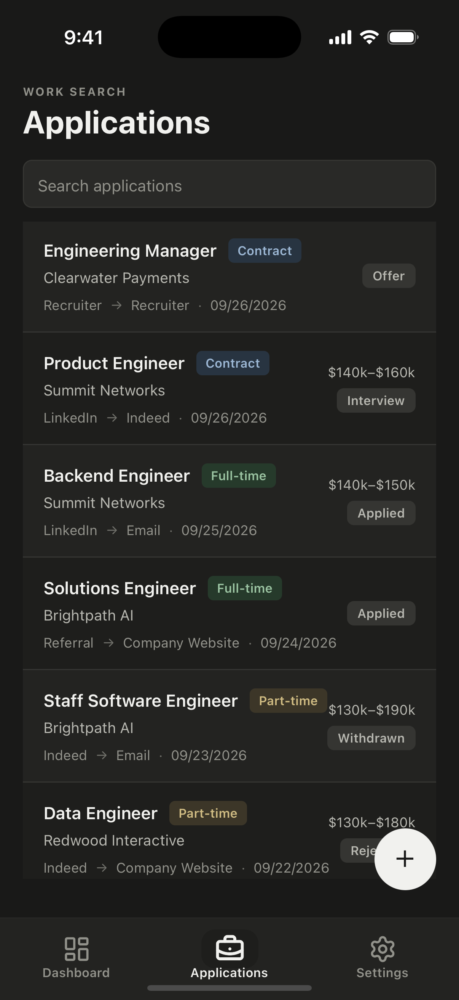
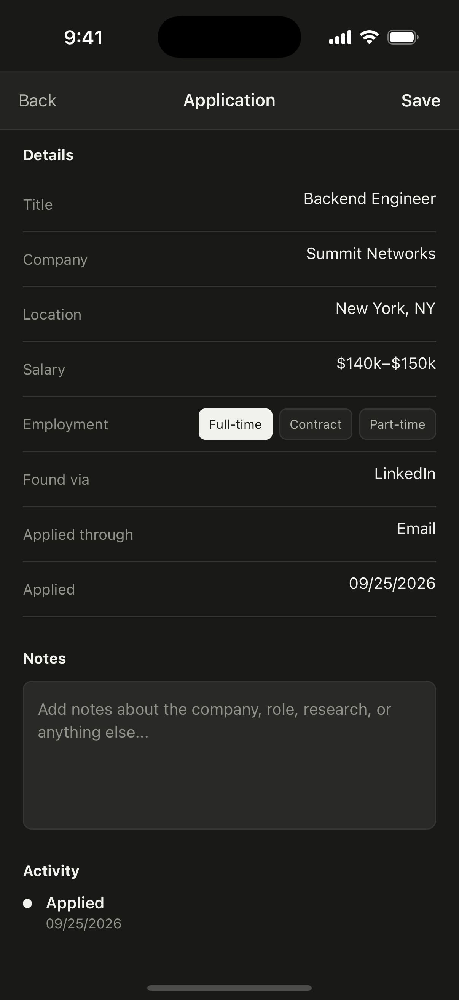
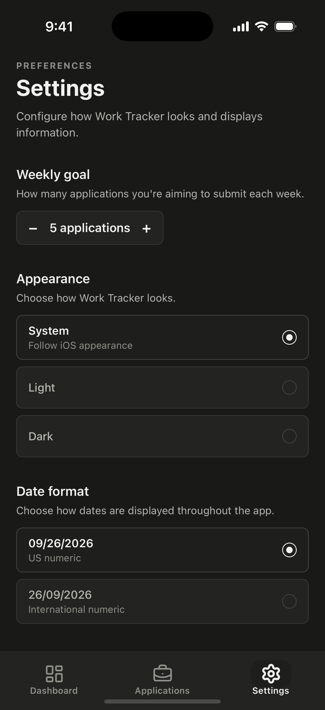
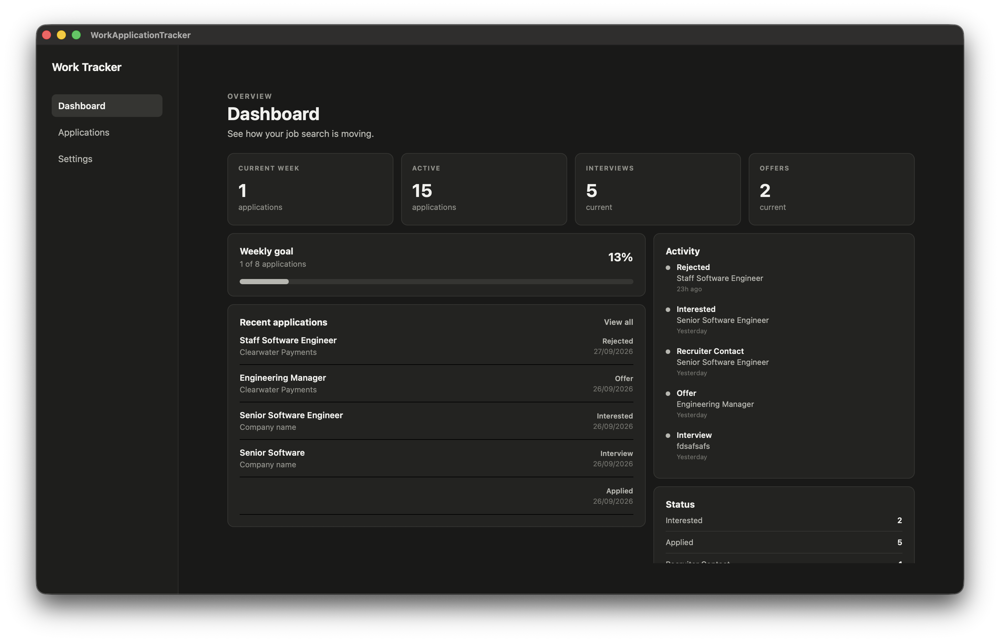
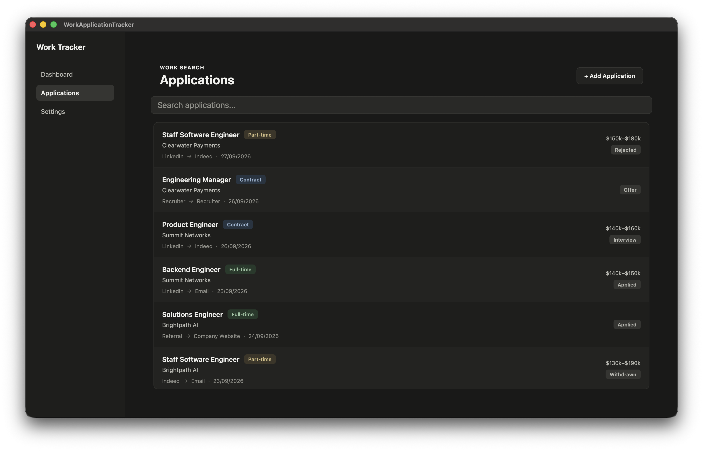
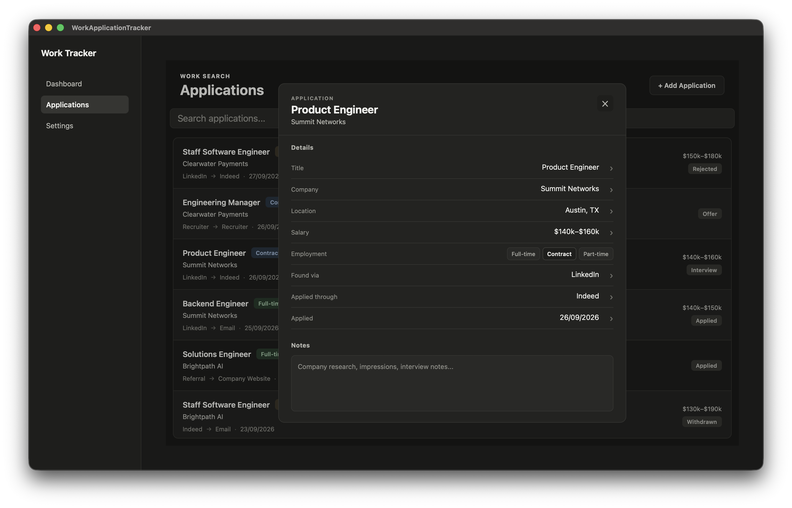
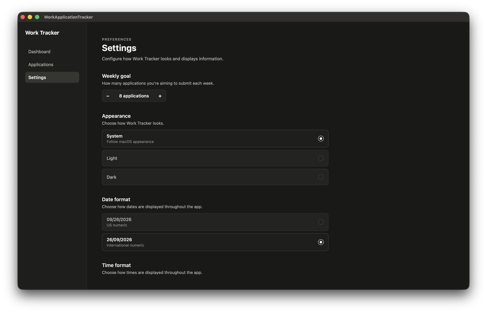

# Work Application Tracker

A cross-platform React Native app for tracking your job search — log applications, follow their status from "Interested" all the way to "Offer", and keep an eye on your weekly application goals. Runs natively on **iOS**, **Android**, and **macOS** from a single codebase.

## ✨ Features

- **Dashboard** — at-a-glance view of your weekly application goal progress, active applications, interviews, and offers, plus a feed of recent applications and activity.
- **Applications list** — searchable list of every application, with employment type badges and applied dates.
- **Application details** — inline-editable title, company, location, salary, status, "found via" / "applied through" sources, applied date, and freeform notes, with a full activity timeline.
- **Add application** — quickly log a new application with employment type, listing/application source, and status.
- **Status tracking** — Interested → Applied → Recruiter Contact → Interview → Offer (or Rejected / Withdrawn / Closed), with an activity log recording every status change.
- **Configurable weekly goal** — set how many applications you're aiming to submit each week; the dashboard tracks your progress against it.
- **Settings** — light/dark/system appearance, date format, time format, and week-start-day preferences, all persisted locally.
- **Local-first storage** — everything is stored on-device (AsyncStorage), no account or backend required.

## 📱 Screenshots

### Mobile (iOS / Android)

| Dashboard | Applications | Application Details | Settings |
| --- | --- | --- | --- |
|  |  |  |  |

### Desktop (macOS)

| Dashboard | Applications | Application Details | Settings |
| --- | --- | --- | --- |
|  |  |  |  |

## 🧱 Tech Stack

- [React Native](https://reactnative.dev) 0.81 + [React Native macOS](https://microsoft.github.io/react-native-windows/docs/rnm-getting-started) for the desktop target
- [React Navigation](https://reactnavigation.org) (bottom tabs + native stack) for mobile navigation
- [Zustand](https://github.com/pmndrs/zustand) for application state, persisted via `@react-native-async-storage/async-storage`
- TypeScript throughout

## 📂 Project Structure

```
app/
  desktop/    # macOS screens, modals, and components
  mobile/     # iOS/Android screens, navigation, and components
  shared/     # Cross-platform store, settings, theme, types, and utilities
```

Desktop and mobile each have their own screens/components tailored to the platform's UX conventions, but both share the same underlying store, settings, theming, and date/status formatting utilities.

## 🚀 Getting Started

> **Note**: Make sure you have completed the React Native [Set Up Your Environment](https://reactnative.dev/docs/set-up-your-environment) guide before proceeding.

### 1. Install dependencies

```sh
npm install
```

### 2. Start Metro

```sh
npm start
```

### 3. Run the app

With Metro running, open a new terminal window/pane from the root of the project:

**Android**

```sh
npm run android
```

**iOS**

For iOS, install CocoaPods dependencies first (only needed on first clone or after updating native deps):

```sh
bundle install
bundle exec pod install
```

Then:

```sh
npm run ios
```

**macOS**

```sh
npm run macos
```

## 🛠 Development

- `npm run lint` — run ESLint
- `npm test` — run the Jest test suite
- In dev builds, the Settings screen includes a **Developer** section with a "Populate mock data" button to quickly seed the app with sample applications for testing/demos.

## 📄 License

Private project — not currently licensed for public use.
